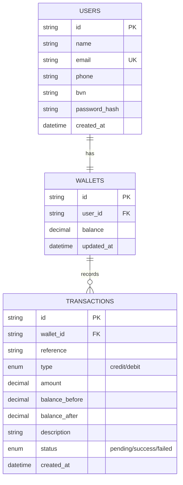

# Demo Credit Wallet Service

A Minimum Viable Product (MVP) wallet service for a mobile lending application, built with Node.js, TypeScript, and Knex.js.

## Project Overview

Demo Credit is a mobile lending platform where borrowers can:
- **Create an account** (with automatic Karma blacklist checks via Lendsqr Adjutor API).
- **Fund their wallet** to receive loans or add money.
- **Transfer funds** to other users within the platform.
- **Withdraw funds** from their wallet.

This service prioritizes security, data integrity (using atomic transactions), and clean architectural patterns.

---

## Technical Audit against Requirements

| Requirement | Status | Implementation Detail |
| :--- | :---: | :--- |
| **Account Creation** | ✅ | `POST /auth/register` with Joi validation and Adjutor Karma check. |
| **Fund Account** | ✅ | `POST /wallet/fund` using Knex transactions. |
| **Transfer Funds** | ✅ | `POST /wallet/transfer` ensures atomicity between sender and recipient. |
| **Withdraw Funds** | ✅ | `POST /wallet/withdraw` with balance verification. |
| **Karma Blacklist Check** | ✅ | Integrated with Adjutor API; rejects registration if user is blacklisted. |
| **Token Authentication** | ✅ | Faux token-based authentication implemented via JWT. |
| **Unit Tests** | ✅ | Comprehensive tests for success and failure scenarios (Auth & Wallet). |
| **KnexJS ORM** | ✅ | Used for schema migrations, seeding, and query building. |
| **MySQL Database** | ✅ | Primary data store for users, wallets, and transactions. |

---

## E-R Diagram

The following diagram illustrates the database schema and relationships:



---

## Tech Stack

- **Runtime**: Node.js (LTS)
- **Language**: TypeScript
- **Framework**: Express.js
- **Database**: MySQL 8.0+
- **ORM/Query Builder**: Knex.js
- **Testing**: Jest, ts-jest
- **Validation**: Joi
- **External API**: Lendsqr Adjutor API

---

## Getting Started

### Prerequisites
- Node.js installed
- MySQL instance running

### Installation

1. Clone the repository:
   ```bash
   git clone <repository-url>
   cd demo-credit
   ```

2. Install dependencies:
   ```bash
   npm install
   ```

3. Configure environment variables:
   Create a `.env` file based on `.env.example`:
   ```bash
   cp .env.example .env
   ```
   Fill in your database credentials and `ADJUTOR_API_KEY`.

4. Run database migrations:
   ```bash
   npm run migrate:latest
   ```

5. Start the development server:
   ```bash
   npm run dev
   ```

### Running Tests
```bash
npm test
```

---

## API Documentation

### Authentication
#### Register
`POST /auth/register`
- **Body**: `{ name, email, phone, bvn, password }`
- **Note**: Rejects if BVN/Email is on Lendsqr Karma blacklist.

#### Login
`POST /auth/login`
- **Body**: `{ email, password }`
- **Returns**: JWT Token.

### Wallet
All wallet endpoints require `Authorization: Bearer <token>`.

#### Fund Wallet
`POST /wallet/fund`
- **Body**: `{ amount }`

#### Transfer
`POST /wallet/transfer`
- **Body**: `{ recipientEmail, amount }`

#### Withdraw
`POST /wallet/withdraw`
- **Body**: `{ amount }`

#### Get Balance
`GET /wallet/balance`

#### Transaction History
`GET /wallet/transactions?page=1&limit=10`

---

## Design Decisions

- **Repository Pattern**: Abstracted database logic into repositories to ensure the service layer remains clean and testable.
- **Transaction Scoping**: Used Knex transactions for all financial operations to prevent race conditions and ensure data consistency (ACID principles).
- **Service Layer Logic**: Business logic is encapsulated in Services, making it easy to mock dependencies during unit testing.
- **Security**: Passwords are hashed using `bcryptjs`. External API calls to Adjutor are encapsulated in a dedicated service.
- **Error Handling**: Centralized error handling using a custom `AppError` class and middleware.
